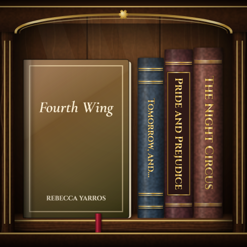
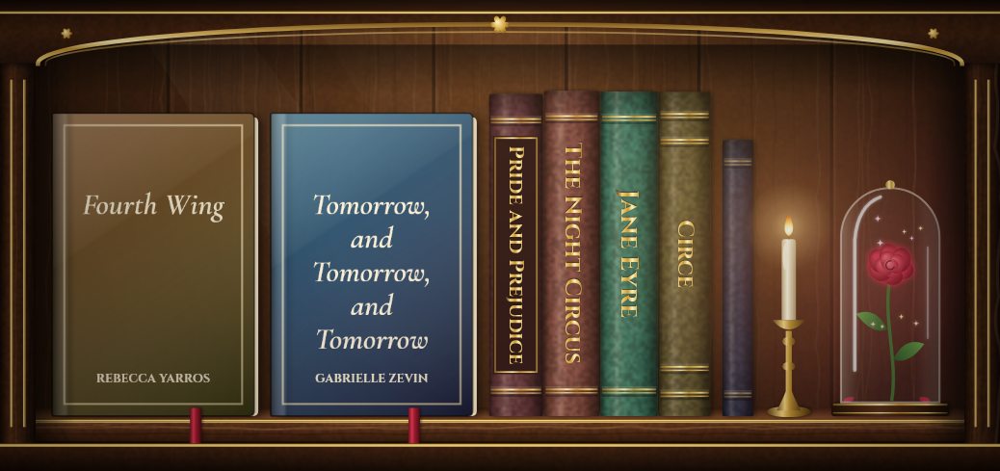
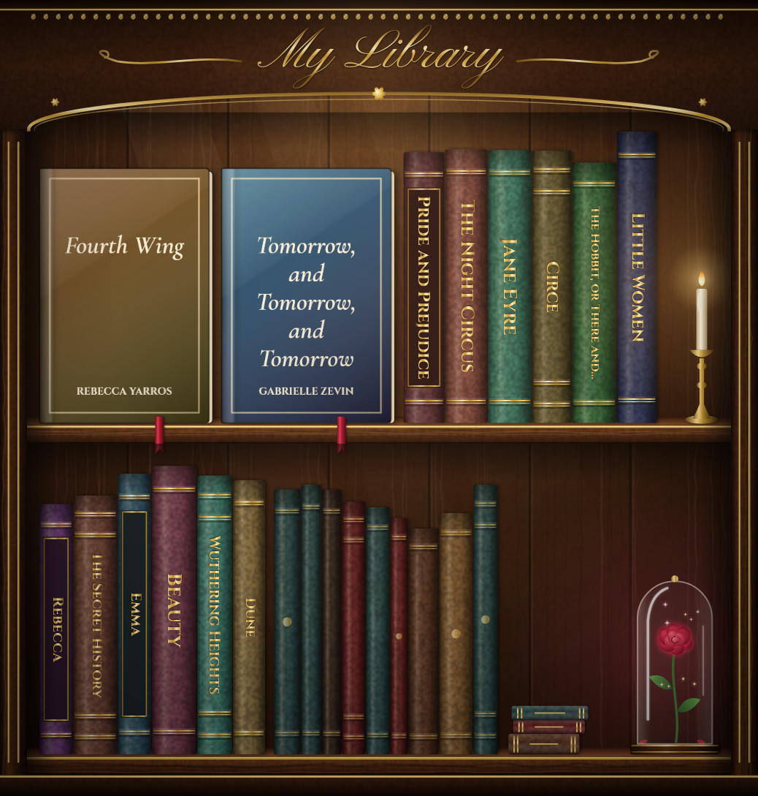

# Enchanted Library — Goodreads bookshelf widget

An iPhone home-screen widget, built for the [Scriptable](https://scriptable.app) app. It paints a candle-lit, dark-wood library bookcase inspired by the Beast's library: an arched, gilded crown, leather-bound spines, a brass candlestick, and the enchanted rose glowing under glass. Your Goodreads books fill the shelves:

- **Currently reading:** cover facing out, with a satin ribbon bookmark
- **Favorites:** leather spines tinted from each book's cover, with the title in gold
- Any leftover space is filled with untitled antique volumes and a stack of books, so the case always looks full

| Small | Medium | Large |
|---|---|---|
|  |  |  |

*(The previews use sample books and stand-in covers. On your phone you'll see your real shelves and real cover art.)*

## Install on your iPhone

1. **Make your Goodreads shelves public.** Goodreads retired its API, so the widget reads your shelves' public RSS feeds. In the Goodreads app or website, go to *Settings → Privacy* and set **Who can view my profile** to *anyone* (or *anyone including search engines*).
2. **Check your favorites shelf name.** The widget reads the shelf named `favorites`. If yours is named something else (e.g. `all-time-favorites`), change `spineShelf` near the top of the script.
3. Install **Scriptable** (free) from the App Store.
4. Copy the entire contents of [`EnchantedLibrary.js`](EnchantedLibrary.js). Open Scriptable, tap **+**, paste, and rename the script to *Enchanted Library* by tapping the title.
5. Tap ▶︎ to try it. Pick a size to preview. The first run downloads your covers.
6. Go to your home screen. Long-press an empty spot, tap **Edit → Add Widget**, search for **Scriptable**, choose a size, and tap **Add Widget**.
7. Long-press the new widget, choose **Edit Widget**, and set **Script** to *Enchanted Library*. Leave *When Interacting* set to **Open URL** so a tap opens your Goodreads profile. Repeat for any other sizes you want.

The widget refreshes every few hours; iOS decides exactly when. It keeps the last shelves it loaded, so it still shows books while you're offline.

## Customizing

Edit the `CONFIG` block at the top of the script:

| Setting | What it does |
|---|---|
| `goodreadsUserId` | The number in your profile URL (`183463841`) |
| `readingShelf` | Shelf shown face-out with ribbons (`currently-reading`) |
| `spineShelf` | Shelf shown as spines (`favorites`) |
| `libraryName` | Script lettering on the large widget's crown (`"My Library"`) |
| `fillEmptySpace` | `false` leaves empty shelf space instead of antique filler books |
| `showRose` | `false` hides the enchanted rose |
| `showCandle` | `false` hides the candlestick |
| `refreshHours` | How often to ask iOS for a refresh |

To force a re-download (for example, after you change a cover on Goodreads), run the script in Scriptable and pick **Clear cache & refresh**.

## Troubleshooting

- **"Couldn't reach Goodreads. Is your profile public?"** Make your profile public (step 1). Also check that `https://www.goodreads.com/review/list_rss/183463841?shelf=favorites` opens in Safari.
- **No spines:** the `favorites` shelf is empty or has a different name (step 2).
- **"Open Scriptable and run Enchanted Library once":** the widget couldn't paint the scene itself and had no saved picture yet. Run the script once in the Scriptable app. That saves pictures of every size for the widget to fall back on.
- **Plain-looking lettering:** the fonts (Cinzel, Cormorant Garamond, Pinyon Script) load from Google Fonts. Without internet access the widget uses the iPhone's built-in Baskerville and Snell Roundhand instead.
- **Lock screen:** the script also works as a lock-screen widget. It shows the title of the book you're reading as text.

## How it works

Scriptable's built-in drawing tools can't do gradients, soft shadows or sideways text. So the script paints the scene in an invisible web view, using a standard HTML canvas, and hands the finished picture to the widget. The painter is the `renderLibrary` function, between the `<renderer>` markers in the script.

## Development

`tools/preview.js` runs that same painter on a computer, with sample books from `tools/sample-feed.js`:

```sh
npm install @napi-rs/canvas
node tools/preview.js path/to/fonts   # writes previews/*.png
```

The fonts folder should hold the Cinzel, Cormorant Garamond and Pinyon Script `.ttf` files from Google Fonts.
